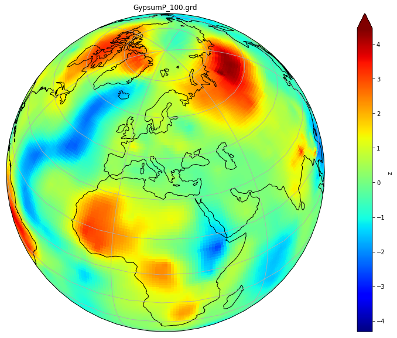

```python
import xarray as xr
%matplotlib inline
import matplotlib as mpl
mpl.rcParams['figure.figsize'] = [20., 10.]
```


```python
filename = "data/Grace/grd_files_to_interp/GypsumP_100.grd"
```


```python
df = xr.open_dataset(filename, decode_cf=False)
```


```python
df
```


 ~~~
    <xarray.Dataset>
    Dimensions:  (lat: 165, lon: 328)
    Coordinates:
      * lon      (lon) float64 -180.0 -178.9 -177.8 -176.7 ... 177.8 178.9 180.0
      * lat      (lat) float64 -90.0 -88.9 -87.8 -86.71 ... 86.71 87.8 88.9 90.0
    Data variables:
        z        (lat, lon) float32 ...
    Attributes:
        Conventions:  COARDS/CF-1.0
        title:        GypsumP_100.grd
        history:      xyz2grd -V -Rd -I1.1 GypsumP_175.txt -GGypsumP_100.grd
        GMT_version:  4.5.5 [64-bit]
~~~
{: .output}


```python
df.z.plot.contourf()
```

```python
import matplotlib.pyplot as plt
import cartopy.crs as ccrs
ax = plt.axes(projection=ccrs.PlateCarree(central_longitude=180))
df.z.plot.contourf(ax=ax,
                   transform=ccrs.PlateCarree())
ax.set_title(df.title)
ax.coastlines()
ax.gridlines()
```


### Create a pseudocolor plot with pcolormesh

```python
import matplotlib.pyplot as plt
import cartopy.crs as ccrs
ax = plt.axes(projection=ccrs.PlateCarree(central_longitude=180))
df.z.plot.pcolormesh(ax=ax,
                   transform=ccrs.PlateCarree())
ax.set_title(df.title)
ax.coastlines()
ax.gridlines()
```


```python
df.z.max()
```


~~~
    <xarray.DataArray 'z' ()>
    array(4.45295)
~~~
{: .output}


```python
import os
import xarray as xr
import numpy as np
import cartopy.crs as ccrs
from cartopy.util import add_cyclic_point
import matplotlib.pyplot as plt

%matplotlib inline

filename = "data/Grace/grd_files_to_interp/GypsumP_100.grd"
dset = xr.open_dataset(filename, decode_cf=False)
z = dset['z'][:,:]
dset.close()

zmin =  dset['z'].min()
zmax = dset['z'].max()


fig = plt.figure(figsize=[20, 10])
ax = fig.add_subplot(1, 1, 1, projection=ccrs.Orthographic(central_longitude=20, central_latitude=40))  # specify (nrows, ncols, axnum)

z.plot.pcolormesh(ax=ax,
                      transform=ccrs.PlateCarree(), 
                      extend='max', vmin=zmin, vmax = zmax, 
                      cmap='jet')

ax.set_title(df.title)
ax.coastlines()
ax.gridlines()
```





```python
import glob
def getint(name):
    _, num = name.split('P_')
    num, _ = num.split('.')
    return int(num)

filenames = glob.glob("data/Grace/grd_files_to_interp/GypsumP_*.grd")

filenames = sorted(filenames, key=getint)

```


```python
print(len(filenames))
```
~~~
    21
~~~
{: .output}



